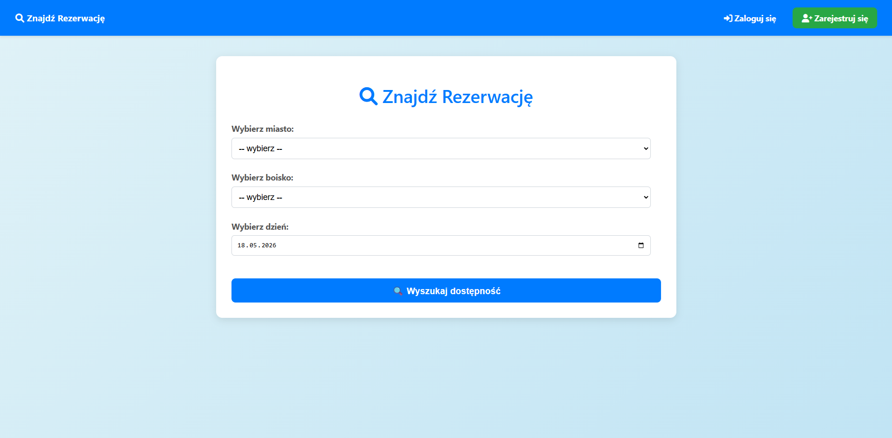
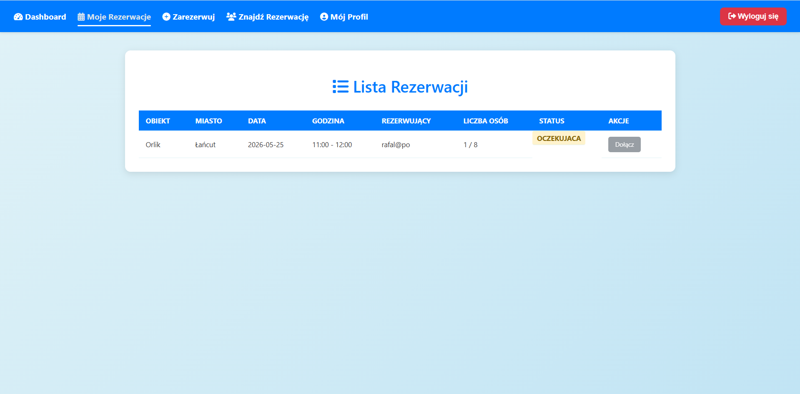
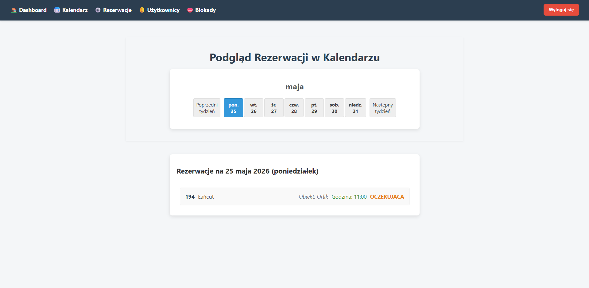

# ⚽ Orlik Booking System

🌐 **Live Demo:** [http://92.5.18.198:8080/](http://92.5.18.198:8080/)

**Dane do konta testowego:**
* **Login:** `user1234`
* **Hasło:** `user1234`

---

## 📸 Zrzuty ekranu

## 🚀 O projekcie
System rezerwacji boisk sportowych (Orlików) stworzony w środowisku Java / Spring Boot. 

Projekt pierwotnie powstał jako klasyczna aplikacja, jednak niedawno przeszedł gruntowny refactoring. 
## 🛠️ Stack Technologiczny
* **Backend:** Java 21, Spring Boot 3, Spring Security, Spring Data JPA
* **Baza Danych:** PostgreSQL, Flyway (migracje), HikariCP
* **Frontend:** HTML5, CSS3, Thymeleaf (z natywną walidacją formularzy)
* **Infrastruktura:** Docker, Docker Compose, Linux (Ubuntu na Oracle Cloud OCI)

## 🎯 Najważniejsze funkcjonalności
* 🔐 **Autoryzacja:** Rejestracja i logowanie z podziałem na role użytkowników.
* 🏟️ **Przegląd Obiektów:** Dynamiczne wyszukiwanie miast, orlików i wolnych terminów.
* 📅 **System Rezerwacji:** Tworzenie rezerwacji (w tym grupowych) z walidacją konfliktów czasowych (LocalTime).
* 👤 **Panel Użytkownika:** Zarządzanie własnymi rezerwacjami i dołączanie do wydarzeń znajomych.
* ⚙️ **Panel Administratora:** Zatwierdzanie rezerwacji, blokowanie obiektów i podgląd kalendarza.
